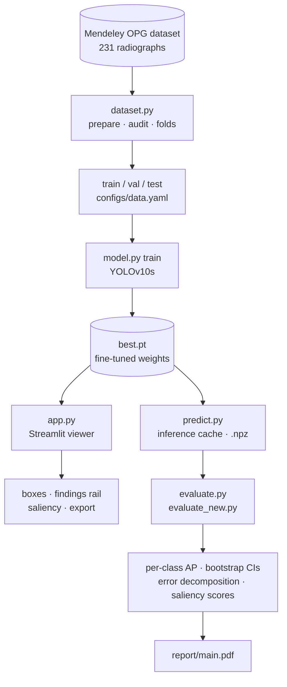
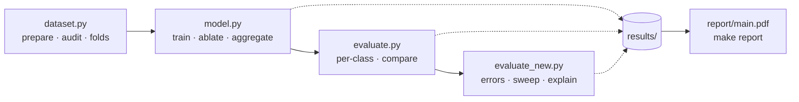
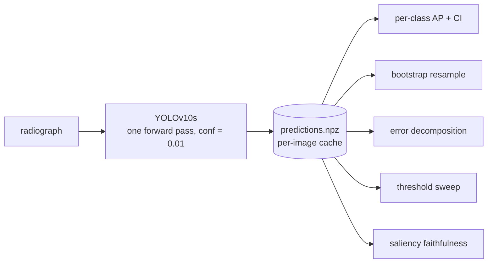
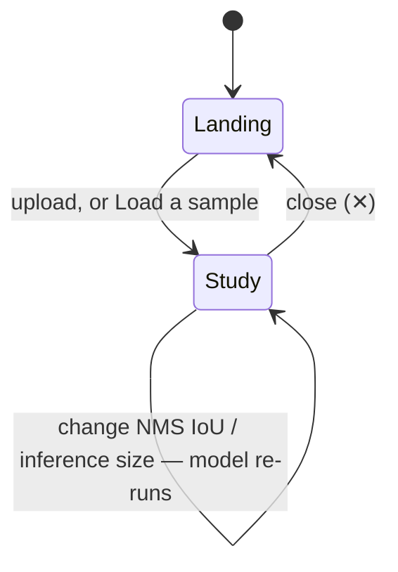

<div align="center">

# DentalScan AI

**Six-class dental condition detection on panoramic radiographs (OPG), with a
research harness for measuring it honestly.**


**[Live demo](https://dentalscan-ai.streamlit.app/)** ·
**[Technical report (PDF)](report/main.pdf)** ·
**[Model card](MODEL_CARD.md)**

</div>

<br>

> [!WARNING]
> Research artefact and demonstration only. Not validated for clinical use,
> not calibrated, and not a substitute for a dentist. See
> [Not a medical device](#not-a-medical-device).

<br>

**Contents** — [What is here](#what-is-here) · [Try it](#try-it) ·
[Results](#results) · [The measurement problem](#the-measurement-problem) ·
[Reproducing everything](#reproducing-everything) ·
[Design notes](#design-notes) · [Layout](#layout) · [Classes](#classes) ·
[The viewer](#the-viewer) · [Data](#data)

---

## What is here

Two things share this repository:

| | |
|---|---|
| 🔍 **A working detector and a Streamlit interface** | Upload an OPG, get colour-coded boxes with confidence scores and a saliency overlay showing where the model looked. |
| 📏 **A measurement harness** | Per-class metrics with bootstrap confidence intervals, grouped cross-validation, a declarative multi-seed ablation grid, TIDE-style error decomposition, and saliency maps scored for faithfulness rather than shown as illustrations. |

The second exists because the first was originally reported as a single number,
`mAP@0.5 = 0.923`, and that number turns out not to be a measurement. The
[technical report](report/main.pdf) explains why in four pages; the short
version is below.

One dataset, one training run, then a fork — the same weights feed a live
viewer and an offline measurement harness, and neither one touches the other:



---

## Try it

```bash
pip install -r requirements.txt
streamlit run app.py
```

No radiograph on hand? Four are bundled — `caries.jpg`, `fractured.jpg`,
`impacted.jpg`, `bdcbdr.jpg` in [`assets/samples/`](assets/samples), one
`Load` click each, no download required. They're drawn from the same Mendeley
dataset the detector trains on (see [Data](#data)), and labelled by the
classification folder they came from — not a claim about what the detector
will find, which is rather the point of an interface that shows measured
recall instead of trusting its own output.

> [!TIP]
> Prefer not to install anything: the [live demo](https://dentalscan-ai.streamlit.app/)
> runs the same app, samples included.

---

## Results

<details open>
<summary><b>Per-class AP@0.5, three architectures, identical recipe</b></summary>
<br>

| Class     | N (val) | YOLOv8n | YOLOv10s  | YOLOv12m  |
|-----------|--------:|--------:|----------:|----------:|
| Caries    | 14      | 0.781   | 0.849     | **0.875** |
| Healthy   | 67      | 0.734   | 0.837     | **0.850** |
| Impacted  | 18      | 0.978   | **0.995** | **0.995** |
| Infection | 4 \*    | 0.750   | 0.870     | 0.788     |
| Fractured | 9 \*    | 0.973   | 0.995     | 0.968     |
| BDC/BDR   | 3 \*    | 0.671   | 0.995     | 0.995     |
| **mAP@0.5 — all six classes**   | | 0.815 | **0.923** | 0.912 |
| **mAP@0.5 — the three with N ≥ 10** | | 0.831 | 0.894 | **0.907** |

\* fewer than 10 validation instances. These are arithmetic, not evidence.

</details>

> [!IMPORTANT]
> The classes driving the high mean are exactly the three with the least
> support — and the ranking of the two leading architectures **inverts**
> depending on whether those classes are counted.

<details>
<summary><b>Cost against accuracy</b></summary>
<br>

| Model    | Best epoch | mAP@0.5   | mAP@0.5:0.95 | Training time |
|----------|-----------:|----------:|-------------:|--------------:|
| YOLOv8n  | 198        | 0.795     | 0.480        | 30 min        |
| YOLOv10s | 214        | **0.928** | 0.611        | **72 min**    |
| YOLOv12m | 240        | 0.909     | **0.625**    | 332 min       |

YOLOv12m costs 4.6× YOLOv10s and does not beat it at IoU 0.5. Its edge at
mAP@0.5:0.95 suggests the extra capacity buys tighter boxes on objects it
already finds, not more detections — which for a triage tool is the less
valuable of the two.

Single runs on one GPU. "Best" is a maximum over epochs on the validation split
and is optimistically biased; it is not a held-out estimate. That is the next
thing the harness fixes.

</details>

<details>
<summary><b>Where the model actually fails</b></summary>
<br>

Inter-class confusion accounts for roughly **1%** of predictions. Essentially
every error is a missed detection or a background false positive:

| Class     | Recall | Support | 95% interval  |
|-----------|-------:|--------:|---------------|
| Impacted  | 1.00   | 18/18   | [0.82, 1.00]  |
| Fractured | 0.89   | 8/9     | [0.56, 0.98]  |
| Caries    | 0.79   | 11/14   | [0.52, 0.92]  |
| Healthy   | 0.64   | 43/67   | [0.52, 0.75]  |
| BDC/BDR   | 1.00   | 3/3     | [0.44, 1.00]  |
| Infection | 0.50   | 2/4     | [0.15, 0.85]  |

The classification head is not the bottleneck — given a proposal, the model
names it correctly. Proposal recall is.

</details>

> [!IMPORTANT]
> Half of all periapical infections are never proposed at all. 82% of
> background false positives are labelled `Healthy`.

---

## The measurement problem

The dataset is 231 annotated radiographs, offline-augmented 3× on the training
side only:

| Split | Images | Source radiographs | Boxes | Caries | Infection | Impacted | BDC/BDR | Fractured | Healthy |
|-------|-------:|-------------------:|------:|-------:|----------:|---------:|--------:|----------:|--------:|
| train | 558    | 186                | 5642  | 853    | 172       | 729      | 69      | 526       | 3293    |
| val   | 23     | 23                 | 115   | 14     | 4         | 18       | 3       | 9         | 67      |
| test  | 23     | 23                 | 102   | 26     | 5         | 12       | **0**   | 5         | 54      |

- **No leakage.** Grouping every file by the source radiograph in its filename,
  the intersection between every pair of splits is empty. Verified, not assumed.
- **Class imbalance is 48:1** in training (Healthy 3293 vs BDC/BDR 69).
- **`BDC/BDR` has zero instances in test.** The held-out split cannot score one
  of the six classes at all.
- **Three classes have fewer than 10 validation instances.** An AP of 0.995 on
  three boxes carries a 95% interval on recall of [0.44, 1.00].

The fix is not a better backbone. It is a protocol the data can support: pooled
**grouped, rarity-aware 5-fold cross-validation** over all 231 radiographs.
Folds are grouped by source image so augmented copies never straddle a
boundary, and assigned rarest-class-first so scarce classes stay present
everywhere. Result:

| | Current split | 5-fold CV |
|---|---:|---:|
| Radiographs used for evaluation | 23 | 231 |
| `BDC/BDR` evaluation instances | 3 | **72** (10–20 per fold) |
| Classes scorable on the held-out set | 5 of 6 | **6 of 6** |
| Trainings required | 1 | 5 |

---

## Reproducing everything

Four CLIs, one shared library, one direction of travel — find the data, train
and ablate it, measure it, explain the errors:



<details>
<summary><b>Full command reference</b></summary>
<br>

```bash
pip install -r requirements-research.txt

# ── dataset.py ── find it, audit it, split it
python dataset.py prepare --search-root . --also-single-copy
python dataset.py audit   --dataset-root <dataset root>
python dataset.py folds   --image-dirs <train/images> <valid/images> <test/images> --folds 5

# ── model.py ── train, ablate, aggregate
python model.py train     --name baseline --model yolov10s.pt --seeds 0 1 2 3 4
python model.py train     --name baseline_cv --model yolov10s.pt --cv-dir configs/cv
python model.py ablate    --dry-run          # what it would run, and what it costs
python model.py ablate    --seeds 0 1 2
python model.py aggregate --manifest results/ablation_manifest.json

# ── evaluate.py ── per-class metrics with intervals, and head-to-head
python evaluate.py per-class --weights runs/.../best.pt --images <test/images> --out results/v10s
python evaluate.py compare   --runs runs/detect/Yolo_8n_250 runs/detect/Yolo_10s_train \
                             runs/detect/Yolo_12m_250epochs \
                             --labels YOLOv8n YOLOv10s YOLOv12m

# ── evaluate_new.py ── why it is wrong, and where it looks
python evaluate_new.py errors  --cache results/v10s/predictions.npz --out results/v10s
python evaluate_new.py sweep   --cache results/v10s/predictions.npz
python evaluate_new.py explain --weights runs/.../best.pt --images <test/images> --faithfulness
```

Every command has `--help`. `dataset.py audit` is the one to run first on any
new data.

`make all` runs the audit, the folds, the comparison and the test suite.
`make report` rebuilds the PDF.

</details>

---

## Design notes

A few choices that are not obvious — expand for the reasoning behind the
cache, the bootstrap, and how ablations are scored. The one that shapes
everything else: predict once, read the cache from everywhere.



<details>
<summary><b>Show the design notes</b></summary>
<br>

**Inference runs once; every metric reads a cache.** A bootstrap confidence
interval needs the metric recomputed on hundreds of resamples. Re-running the
network each time is wasteful, so `predict.py` caches per-image predictions
and ground truth to an `.npz`, and everything downstream — per-class AP,
intervals, error decomposition, threshold sweeps, model-vs-model comparison —
is NumPy over that cache. One artefact, fully traceable, and a threshold sweep
costs nothing.

**AP is implemented here, not read off the framework**, for the same reason.
It follows the COCO convention and is pinned by unit tests against
Ultralytics' own `ap_per_class` to within 0.02 AP on randomised inputs
(`tests/test_metrics.py`).

**Precision and recall are reported at the deployed threshold (0.25)**, not
as curve summaries. AP says nothing about behaviour at the operating point a
clinician actually sees.

**The bootstrap resamples images, not boxes.** Boxes within one radiograph
are correlated; a box-level bootstrap would understate the interval.

**Classes with no ground truth return NaN, never 0.0.** A silent zero in a
macro average is the easiest way to publish a wrong number.

**Ablations are deltas from one baseline**, declared in
[`configs/ablation.yaml`](configs/ablation.yaml) with a stated hypothesis
each, so any difference in the result is attributable to the delta. Every
variant reports mean ± std over seeds with Welch's *t* and Cohen's *d*, so
"moved the needle" and "within noise" are verdicts rather than adjectives.

**Saliency maps are scored, not just shown.** Pointing-game energy (fraction
of saliency mass inside the predicted boxes, against the box-area chance
rate) and deletion AUC against a random-order baseline. A map that scores at
chance is decoration.

</details>

---

## Layout

One file tree, two purposes: the four CLIs and `src/dentalscan/` are the
harness, `app.py` is the viewer.

<details>
<summary><b>Show the full file tree</b></summary>
<br>

```
dataset.py             prepare | audit | folds
model.py               train | ablate | aggregate
evaluate.py            per-class | compare
evaluate_new.py        errors | sweep | explain
app.py                 Streamlit viewer
.streamlit/config.toml theme and upload limits

src/dentalscan/        the library those four CLIs share
  constants.py         classes, validated palette, canonical paths
  data.py              dataset audit, leakage check, grouped CV splits
  metrics.py           AP, per-class metrics, bootstrap and paired bootstrap
  predict.py           inference cache: predict once, analyse many times
  error_analysis.py    TIDE-style decomposition, size strata, threshold sweep
  explain.py           Eigen-CAM, Grad-CAM, pointing energy, deletion AUC
  train.py             seeded training with recorded provenance
  aggregate.py         mean ± std, Welch's t, Cohen's d, verdicts
  report.py            Markdown and LaTeX table rendering
  viz.py               figures

assets/samples/        four bundled radiographs for the viewer's "Load" picker
  thumbs/               downscaled previews shown in the picker itself

configs/
  data.yaml            generated by `dataset.py prepare`
  ablation.yaml        the ablation grid, as deltas from the baseline
  cv/                  generated fold configs and image lists
tests/                 known-answer tests, cross-checked against Ultralytics
report/                LaTeX source and the compiled PDF
results/               generated metrics, figures, audit
```

</details>

---

## Classes

| # | Class     | Description |
|---|-----------|-------------|
| 0 | Caries    | Carious lesion — radiolucency in enamel or dentine |
| 1 | Infection | Periapical or periodontal infection |
| 2 | Impacted  | Tooth that failed to erupt into normal occlusion |
| 3 | BDC/BDR   | Bone defect, coronal or root region |
| 4 | Fractured | Crown or root fracture |
| 5 | Healthy   | Normal tooth region, no visible pathology |

`Healthy` is a background label rather than a condition, which makes the
six-class mean a mixture of two different tasks. See the
[model card](MODEL_CARD.md).

---

## The viewer

```bash
pip install -r requirements.txt
streamlit run app.py
```

Two screens on an indigo ground (the "Nocturne" palette — see below). The
landing page states the claim on the left and takes the study on the right,
then puts the per-class recall table directly underneath it — the honesty is
the first thing on the page, not a footnote. Once a study is loaded the
layout splits: the radiograph and the two controls that govern it on the
left, an evidence rail of findings on the right.

**Nothing to upload? Load a bundled sample.** Under the drop target sit four
radiographs, one per condition, each a thumbnail and a `Load` button — see
[Try it](#try-it). Clicking one runs it through the exact same path a real
upload takes: same size check, same SHA-256 dedup, same error handling.



| Feature | What it does |
|---|---|
| **SVG overlay** | Boxes are vector elements *over* the image, not burned in — razor sharp at 12× zoom, every box hoverable and clickable |
| **Progressive disclosure** | Threshold and condition pills up front; labels, overlay strength, NMS IoU, inference size live behind `Settings` |
| **Evidence rail** | Four stat tiles, then one card per finding — class, confidence as a number and a bar, and a recall badge |
| **One forward pass** | Runs once at confidence 0.01; the threshold and pills just re-filter that cached result, instantly |
| **`Healthy` recessive** | Off and grey by default — it's a background label (58% of training boxes), not a finding |
| **Recall badges** | ⚠ unmeasured (n < 10), ↓ recall below 0.70 — travels with every detection, not just the class legend |
| **Export** | Annotated PNG, findings CSV, and a JSON record — all named to the weights and image by SHA-256 |
| **Motion** | Pure CSS keyframes; degrades to a static page if anything fails, collapses under `prefers-reduced-motion` |

<details>
<summary><b>How each piece works, in detail</b></summary>
<br>

**Boxes are SVG, not pixels.** The overlay is drawn as vector elements *over*
the image rather than burned into it, which buys three things a rasterised
overlay cannot: strokes stay razor sharp at 12× zoom; outlines and markers
counter-scale, so a box is 2 screen pixels whether you are looking at the
whole jaw or one molar; and every box is a live element — it draws itself in
on load, dims when a sibling is hovered, and carries a tooltip with the
class, the confidence and that class's measured recall. Click a marker and
the view flies to it. (`draw_overlay()` still rasterises for the PNG export,
where the annotations have to live inside the pixels.)

**Progressive disclosure.** Directly under the radiograph: the confidence
threshold, which prints its own value at a size you can read across a room
and says how many findings it is hiding. Under that, the condition pills,
each carrying its class's hue and a count that moves with the threshold.
Everything else — labels, interior wash, overlay strength, NMS IoU,
inference size — lives behind `Settings`; downloads behind `Export`.
Saliency is a toggle that swaps the viewport contents in place rather than a
second tab.

**The rail is the evidence.** Four tiles — findings, conditions, mean
confidence, and how many of those findings sit on a class the data cannot
measure — then one card per finding: the class, its confidence as a number
and as a bar, and the recall badge. The count of weakly-measured findings
turns amber when it is not zero, which is the one number on the page that is
a warning rather than a result.

**One forward pass.** Inference runs once per image at confidence 0.01. The
threshold and the pills filter that cached result, so they respond instantly
and every displayed number comes from a single pass. Changing NMS IoU or
inference size does re-run the model — a shimmering skeleton holds the
viewport's place while it does.

**Motion.** All of it is CSS: Streamlit strips `<script>` from `st.markdown`,
so the page's animation is keyframes, transitions and staggered
`animation-delay`. That also means it degrades to a static, readable page if
anything fails, and collapses to nothing under `prefers-reduced-motion`.
Inside the viewport component, where real JS is available, the boxes animate
their stroke in and the zoom eases.

**`Healthy` is grey and off by default.** It is a background label, not a
finding, and 58% of all boxes in the training data; drawn like pathology it
buries the pathology.

**Measured recall travels with every detection.** Each finding carries its
class's validation recall and support, badged ⚠ when the class has fewer
than ten instances and is effectively unmeasured, ↓ when recall is below
0.70. A model that misses half of all infections should not present an
infection the same way it presents an impacted tooth.

**Export.** Annotated PNG at full resolution, findings CSV, and a JSON
record that names the weights and the image by SHA-256 and carries every
threshold in force — so a finding can be traced back to exactly what
produced it. The checkpoint hash lives there and in the status chip's
tooltip; it is provenance, not a headline.

The app looks for `runs/detect/Yolo_10s_train/weights/best.pt`. Without it,
it loads the base COCO model and says so in a red banner — those detections
are meaningless for dental use.

Type is Inter throughout — headings at weight 500 rather than a display
face, so the radiograph stays the loudest thing on screen — with IBM Plex
Mono for figures, and sized for reading at a glance rather than squinting:
body copy sits at 15–16px, secondary metadata never drops below 13px. The
chrome is the Nocturne palette: an indigo ground, a blurple accent, and
elevation carried by a hairline instead of a glow. Secondary text sits one
step brighter than the design system specifies, because its neutral-600
measures 3.4:1 against the card surface and fails AA at body size;
neutral-500 measures 5.1:1. Box colours are the five-hue pathology palette
in `constants.py`, chosen by search inside the OKLCH lightness band for a
dark surface and verified against a six-check palette validator (lightness
band, chroma floor, all-pairs colour-vision-deficient separation, all-pairs
normal-vision separation, contrast against the surface). Class identity is
never carried by colour alone: every box has a numbered marker, hovering
names the class, and every findings row names it in text.

</details>

---

## Data

[Dental OPG X-Ray Dataset](https://data.mendeley.com/datasets/c4hhrkxytw/4),
Mendeley Data. 231 annotated panoramic radiographs, six classes. The four
samples bundled in [`assets/samples/`](assets/samples) for the viewer's
"Load" picker are downscaled frames from this dataset's classification
split, included for trying the interface without one on hand — not
additional training or evaluation data.

---

## Not a medical device

> [!WARNING]
> Research artefact and demonstration only. Not validated for clinical use,
> not calibrated, trained on a single-source dataset with one annotator and
> no inter-rater agreement statistics. Do not use it to make decisions about
> anyone's teeth.
